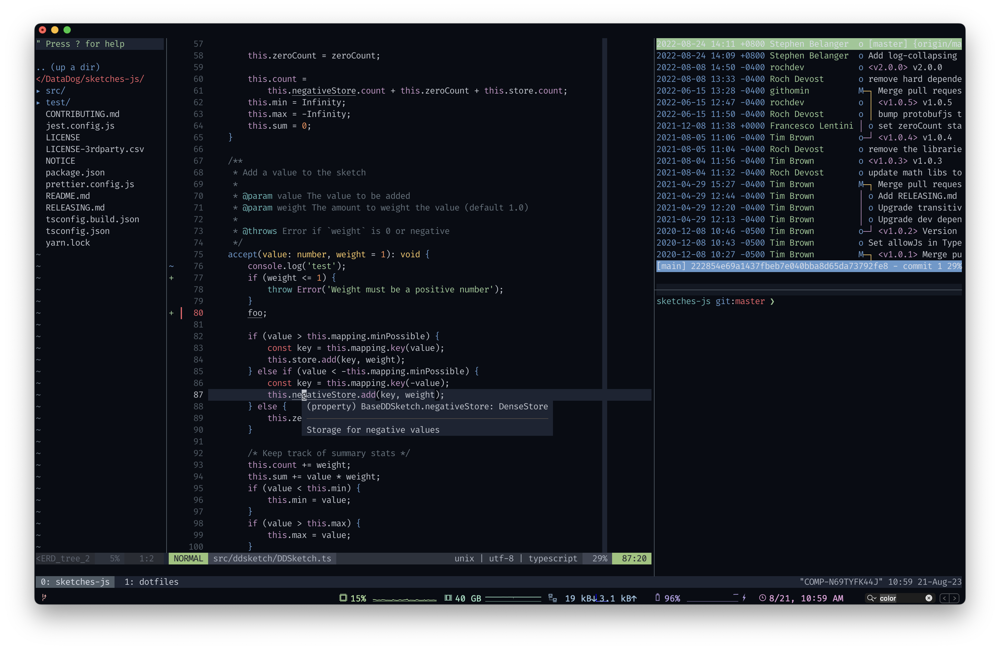

# Visual
* Theme: Tomorrow Night (modified)
* Font: Inconsolata-g

# Tools
* nvim
* tmux
* zsh
* iTerm2

# Setup (currently manual)

## Install
* Install brew: https://brew.sh/
* Install neovim via brew: `brew install neovim`

* Install zsh via brew: `brew install zsh`
* Install [oh-my-zsh](https://github.com/robbyrussell/oh-my-zsh#via-curl)
* Install [zsh-autosuggestions](https://github.com/zsh-users/zsh-autosuggestions#oh-my-zsh)
* Install [zsh-syntax-highlighting](https://github.com/zsh-users/zsh-syntax-highlighting/blob/master/INSTALL.md#oh-my-zsh)
* Install [zsh-history-substring-search](https://github.com/zsh-users/zsh-history-substring-search#install)

* Install trash via brew: `brew install trash`

## Link
* `ln -s ~/dotfiles/.gitconfig ~/.gitconfig`
* `ln -s ~/dotfiles/.alias ~/.alias`
* `ln -s ~/dotfiles/.zshrc ~/.zshrc`
* `ln -s ~/dotfiles/.tmux.conf ~/.tmux.conf`

* `mkdir ~/.config/nvim`
* `ln -s ~/dotfiles/.nvimrc ~`

## Vim-specific
* Install [vim-plug](https://github.com/junegunn/vim-plug#installation)
* Run `:PlugInstall`
